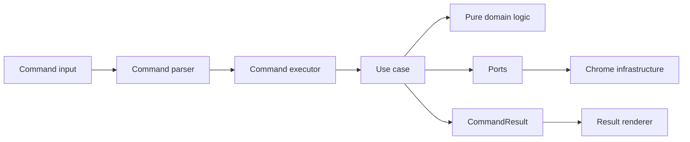

# アーキテクチャと責務境界

このページでは、Bookmark CLI Extensionの実装をどの責務へ分けるかを定義します。

v1では、Chrome拡張の入出力とBookmark操作を端に寄せ、Bookmark CLIの中心ロジックを純粋関数として保ちます。

## 基本方針

Domain層は技術的な分類ではなく、Bookmarks as filesystemに由来するユビキタス言語を中心にmoduleを分けます。

Domain層はChrome API、DOM、storage、時刻、乱数へ直接依存しません。

Application層はuse caseを表し、Domain層の純粋関数とPortを組み合わせます。

Infrastructure層はChrome APIと `chrome.storage` へのアクセスを担当します。

保存データのschema検証はInfrastructure層のstorage adapterで行います。

Presentation層はDedicated extension page、popup、結果表示、キーバインドを担当します。

Entry pointはWXTの規約に従い、Chrome拡張として起動する薄い接続点にします。

依存方向は外側から内側へ向けます。

内側のDomain層から外側のInfrastructure層を参照しません。

```text
entrypoints
  -> presentation
    -> application
      -> domain
      -> ports
infrastructure
  -> ports
```

## レイヤー構成

```text
src/
  entrypoints/
    background.ts
    cli-page/
    popup/
  application/
    commands/
    usecases/
    ports/
  domain/
    bookmarks/
    navigation/
    search/
    tags/
    results/
    history/
    shared/
  infrastructure/
    chrome/
  presentation/
    cli/
```

### entrypoints

`entrypoints` はWXTの起動点です。

background、Dedicated extension page、popupを配置します。

entrypointでは初期化、イベント登録、依存の組み立てだけを行います。

Bookmark検索、path解決、storageのshape変換などの実処理はentrypointへ書きません。

### presentation

`presentation` は疑似CLIの見た目と入力体験を担当します。

UI実装方針の詳細は [UI実装方針](../ui-implementation/) で管理します。

Presentation層はReactとTailwind CSSで実装します。

コマンド入力欄、Powerline風prompt、候補表示、plain text結果一覧、キーバインドを扱います。

Presentation層はCommand実行結果を表示用view modelへ変換します。

Presentation層はChrome Bookmarks APIや `chrome.storage` を直接呼びません。

### application

`application` は疑似CLIのuse caseを担当します。

`go`、`find`、`mark`、`ls`、`cd`、`tree`、`mv`、`rm`、`rename`、`tag` などのコマンド実行を扱います。

Application層はPortを通してBookmark Tree、保存データ、起動元タブ、現在時刻へアクセスします。

Application層はChrome APIの具体的な戻り値を知りません。

Chrome API由来の値は、Infrastructure層でDomainまたはApplication向けの型へ変換します。

保存データはInfrastructure層でtypia validatorを通し、検証済みの値だけをApplication層へ渡します。

### domain

`domain` はBookmark CLIの中心ルールを担当します。

Domain層のmoduleは、技術都合ではなくユビキタス言語を基準に分けます。

Bookmark Treeの正規化、folder path解決、fuzzy検索、仮想タグの正規化、結果一覧の番号解決を置きます。

Domain層の関数は、同じ入力に対して同じ出力を返す純粋関数として実装します。

Domain層のロジックにはテストを書きます。

Domain層は、functional coreとして扱います。

入力はplain dataとして受け取り、出力もplain dataとして返します。

中心になる語彙は次のとおりです。

- `BookmarkTree`
- `BookmarkEntry`
- `FolderPath`
- `CurrentDirectory`
- `VirtualTag`
- `ResultList`
- `BookmarkSelection`
- `LaunchContext`

Chrome Bookmark Managerに存在するBookmark本体は、外部システム由来の参照対象として扱います。

`CurrentDirectory`、`VirtualTag`、`ResultList` は、この拡張機能が所有するDomain modelとして扱います。

CLI文字列のparserはDomain modelではありません。

parserは入力文字列をApplication層のCommand ASTへ変換し、Domain層には意味づけ済みの値だけを渡します。

### infrastructure

`infrastructure` は外部APIへの接続を担当します。

Chrome Bookmarks API、Chrome Tabs API、Chrome Extensions Storage APIをここに閉じ込めます。

Infrastructure層はApplication層が定義したPortを実装します。

Chrome APIの失敗は、Application層で扱えるerror codeへ変換します。

## 関数型寄りの実装方針

実装は、functional coreとimperative shellの分離を意識します。

Domain層とApplication層の中心ロジックは、できるだけ純粋関数として実装します。

入力値はreadonlyな値として扱い、既存の値を直接変更しません。

一覧変換、抽出、並び替え、畳み込みは、読みやすい範囲で `map`、`filter`、`flatMap`、`reduce` を使います。

ただし、関数型らしさを目的にしません。

`for` loopの方が読みやすい場合や、早期returnで意図が明確になる場合は、その書き方を許容します。

Chrome API、storage、tab操作、event listener登録はimperative shellとして外側へ置きます。

RxJSのようなstream libraryは、v1初期の必須依存にはしません。

コマンド入力、キーバインド、debounce、cancel、非同期実行状態の組み合わせが複雑になった時点で検討します。

導入場所は、Presentation層またはApplication境界に限定します。

Domain層はstream libraryへ依存しません。

streamを導入した場合でも、use caseとDomain関数はplain dataで呼び出せる形を保ちます。

## Port設計

Application層は、次のPortを通して外部世界へアクセスします。

```ts
type BookmarkRepository = {
  getTree: () => Promise<BookmarkTree>;
  createBookmark: (input: CreateBookmarkInput) => Promise<BookmarkNode>;
  createFolder: (input: CreateFolderInput) => Promise<BookmarkNode>;
  moveNode: (input: MoveBookmarkInput) => Promise<BookmarkNode>;
  updateNode: (input: UpdateBookmarkInput) => Promise<BookmarkNode>;
  removeBookmark: (id: string) => Promise<void>;
};

type ExtensionStorage = {
  loadState: () => Promise<ExtensionState>;
  saveState: (state: ExtensionState) => Promise<void>;
};

type TabContext = {
  getLaunchContext: () => Promise<LaunchContext | null>;
  openBookmarkUrl: (url: string) => Promise<void>;
};

type Clock = {
  now: () => Date;
};
```

実装時の型名は変更できます。

ただし、Application層がChrome APIを直接参照しない境界は守ります。

## コマンド実行フロー

疑似CLIのコマンドは、次の順番で処理します。

1. Presentation層が入力文字列を受け取る
2. Application層のcommand parserがCommand ASTへ変換する
3. Application層のexecutorが対応するuse caseを呼ぶ
4. use caseがPort経由でBookmark Treeや保存データを取得する
5. Domain層の純粋関数が検索、path解決、結果選択を担う
6. use caseが必要なChrome書き込み操作をPort経由で実行する
7. use caseがCommandResultを返す
8. Presentation層がCommandResultをplain text結果一覧へ変換する
9. Presentation層が直前の結果一覧を一時保存する



## `mark` の起動元タブ

Dedicated extension pageを開いた後、Chrome上のactive tabは拡張ページ自身になります。

そのため、`mark` は実行時のactive tabではなく、CLI起動元タブを保存対象にします。

background entrypointは、hot key、popup、拡張actionからCLI windowを開くときに起動元タブのsnapshotを取得します。

CLIは通常tabではなく、Dedicated extension pageを別windowとして開きます。

取得した `tabId`、`title`、`url` は `launchContext` として一時保存します。

`mark` use caseは `TabContext` Portから `launchContext` を取得します。

`launchContext` が存在しない場合、またはURLとtitleを取得できない場合は `unsupported_tab` を返します。

## 書き込み操作

`mkdir`、`mv`、`rename` は対象と変更先を解決できたら即時実行します。

`rm` は通常実行でPresentation層の確認待ち状態に入り、`-f` または `--force` の場合だけ即時実行します。

Chrome Bookmarks APIへの書き込みはInfrastructure層で実行します。

Application層は対象解決、入力検証、Port経由の書き込み実行を扱います。

`rm` の対象はv1ではBookmarkだけです。

Folder削除は後続で扱います。

## エラー境界

Domain層はChrome APIのerrorを知りません。

Domain層は `not_found`、`folder_not_found`、`invalid_argument` など、CLIの意味に近いerrorを返します。

Infrastructure層はChrome APIの失敗を `chrome_bookmarks_failed` や `permission_denied` へ変換します。

Application層はDomain errorとInfrastructure errorをCommandResultへ変換します。

Presentation層はCommandResultのerrorを表示します。

Presentation層でerrorの意味を再解釈しません。

## テスト方針

テスト方針の詳細は [テスト方針](../testing-policy/) で管理します。

Domain層の純粋関数にはテストを書きます。

対象は、Bookmark Tree正規化、folder path解決、fuzzy検索、仮想タグ正規化、結果一覧の番号解決です。

command parserも純粋関数として扱い、正常系と必要な異常系だけをテストします。

storage migrationは保存データの破損を防ぐため、versionごとにテストします。

schema検証はtypiaの内部ではなく、storage adapterの成功、失敗、fallback分岐をテストします。

Application層のuse caseはPortをmockしてテストします。

Infrastructure層は薄く保ち、単体テストではChrome API呼び出しのadapter境界だけを確認します。

Presentation層は、表示用view modelへの変換とキーバインドの状態遷移を中心にテストします。

## 実装ルール

Chrome APIを直接呼ぶファイルは `infrastructure/chrome` と `entrypoints` に限定します。

`entrypoints` でChrome APIを呼ぶ場合は、イベント登録や起動時context取得など、entrypoint固有の処理に限定します。

Command実行中に必要なChrome API呼び出しは、Portを通します。

Domain層から `Date.now()` を呼びません。

時刻が必要なuse caseは `Clock` Portを使います。

Domain層から `Math.random()` を呼びません。

ID生成が必要になった場合は、Application層からID生成Portを渡します。

UI表示用の装飾文字列はDomain層へ持ち込みません。

Powerline風prompt、Nerd Font互換icon、CSS class名はPresentation層で扱います。
